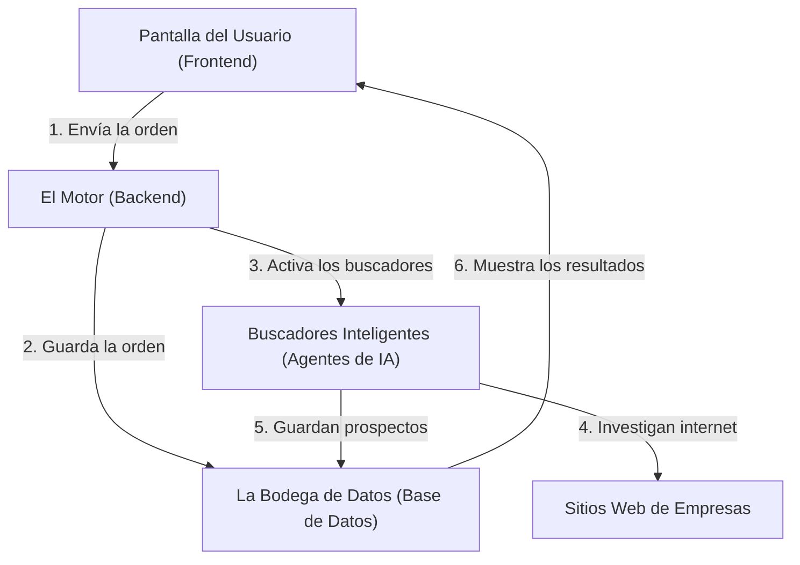

# 🤖 Plataforma de Prospección Inteligente (SDR) — DM Event Lovers

¡Bienvenido a la guía de tu nueva plataforma! Este documento está diseñado especialmente para ser comprendido por cualquier persona, sin importar su nivel de conocimientos técnicos. 

Aquí te explicamos qué es este sistema, cómo funciona por dentro de forma sencilla, qué partes lo componen y cómo usarlo en tu día a día.

---

## 1. 📝 Descripción General del Proyecto

Esta plataforma es un **asistente comercial inteligente y autónomo (SDR)**. Su objetivo principal es ayudarte a encontrar clientes potenciales (prospectos) para tu negocio de organización de eventos corporativos, banquetes y catering de forma 100% automática.

En lugar de pasar horas buscando restaurantes, hoteles o empresas en Google de uno en uno, el sistema hace el trabajo pesado por ti:
1. **Busca** en internet empresas que coincidan con lo que necesitas.
2. **Analiza** sus sitios web para entender si son buenos candidatos.
3. **Identifica** a la persona de contacto clave (como el Director de Operaciones o Gerente de Eventos) y extrae sus datos.
4. **Redacta** propuestas personalizadas listas para que solo tengas que copiarlas y enviarlas por Email, WhatsApp o LinkedIn.

---

## 2. 🏗️ Arquitectura (¿Cómo funciona por dentro de forma sencilla?)

Para entender cómo funciona el sistema, imagínalo como un restaurante:

*   **La Pantalla (El Frontend):** Es la cara visible del sistema (lo que ves en tu navegador). Es la mesa del restaurante donde haces tus pedidos, ves los menús y recibes tus platos.
*   **El Motor (El Backend):** Es la cocina. No la ves, pero es donde se procesa todo. Recibe tus órdenes de búsqueda y coordina el trabajo de los agentes de Inteligencia Artificial.
*   **La Bodega de Datos (Base de Datos):** Es la alacena donde guardamos de manera ordenada y segura todas tus búsquedas anteriores, tus datos de acceso y los prospectos encontrados para que nunca se pierdan.
*   **Los Buscadores Inteligentes (Agentes de IA):** Son tus investigadores privados. Utilizan inteligencia artificial avanzada para navegar en internet, leer páginas web en tiempo real, calificar el nivel de interés de las empresas y redactar mensajes comerciales adaptados a cada una de ellas.

---

## 3. 🧩 Componentes Principales

La plataforma tiene tres secciones clave que verás en tu pantalla:

1.  **Tablero de Control (Dashboard):** 
    Es tu panel principal. Te muestra un resumen rápido de las búsquedas activas, cuántos prospectos has encontrado y las últimas actividades del sistema.
2.  **Creador de Búsquedas (Creador de Campañas):**
    Un formulario muy simple donde le describes al asistente virtual qué es lo que quieres. Solo necesitas escribir en tus propias palabras qué tipo de cliente buscas (ejemplo: *"Restaurantes tradicionales en Guadalajara con terraza para eventos"*).
3.  **Bandeja de Prospectos (Leads):**
    Es el cofre del tesoro. Una tabla con todas las empresas encontradas donde puedes ver:
    *   Nombre de la empresa y su página web.
    *   Una calificación de afinidad (qué tan buen cliente podría ser).
    *   El nombre de la persona a contactar, su puesto y su correo electrónico.
    *   **Mensajes redactados a la medida** listos para copiar y enviar por correo, WhatsApp o LinkedIn.

---

## 4. 📖 Manual de Funcionamiento (Paso a Paso)

Usar la plataforma es sumamente sencillo. Solo debes seguir estos pasos:

### Paso 1: Iniciar Sesión 🔑
Entra al enlace de la aplicación e ingresa con tu correo y contraseña asignados. Esto te llevará directamente a tu panel de control personalizado y seguro.

### Paso 2: Crear una Campaña de Búsqueda 🎯
1. Ve a la sección **Campañas** y haz clic en **"Nueva Campaña"**.
2. Dale un **Nombre** descriptivo (ejemplo: *Restaurantes Top en Guadalajara*).
3. Ingresa la **Ciudad** en la que quieres buscar.
4. Escribe el **Límite de Prospectos** que deseas encontrar en esta sesión.
5. En el campo de **Instrucciones (Prompt)**, describe detalladamente tu cliente ideal en tu propio lenguaje. *Ejemplo: "Quiero encontrar restaurantes premium que tengan áreas para banquetes privados o terrazas para ofrecerles servicios de organización de eventos corporativos".*
6. Haz clic en **"Iniciar Búsqueda"**.

### Paso 3: Observa al Agente trabajar en tiempo real 🕵️‍♂️
Una vez iniciada la búsqueda, verás una bitácora de actividad en tiempo real. Podrás leer exactamente qué está haciendo el asistente inteligente en cada segundo (ejemplo: *"Buscando restaurantes en Google..."*, *"Analizando la página web de La Chata..."*, *"Extrayendo datos de contacto..."*).

### Paso 4: Revisa y Utiliza tus Prospectos 📈
Una vez completada la barra de progreso al 100%:
1. Entra a los resultados de la campaña.
2. Verás la lista de empresas encontradas con su información de contacto.
3. Haz clic en cualquier prospecto para ver las sugerencias de mensajes.
4. Elige el canal que prefieras (Email, WhatsApp o LinkedIn), copia el texto personalizado que la IA redactó y envíaselo a tu cliente potencial para iniciar la conversación.

---
*Plataforma optimizada y lista para impulsar el crecimiento comercial de DM Event Lovers.*
